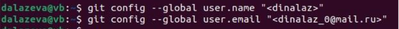
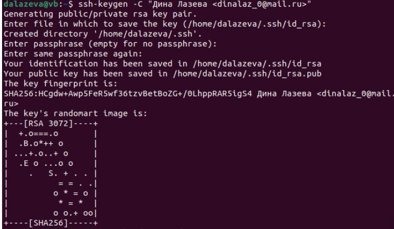
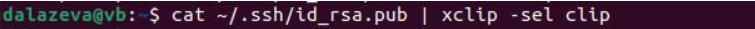
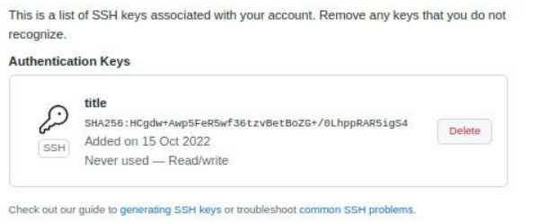
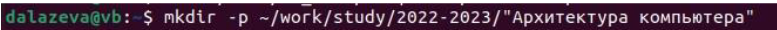
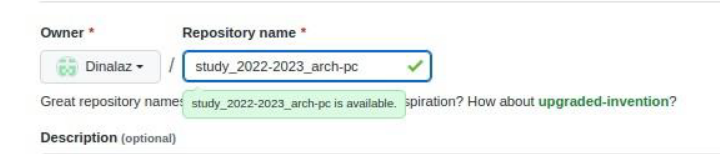
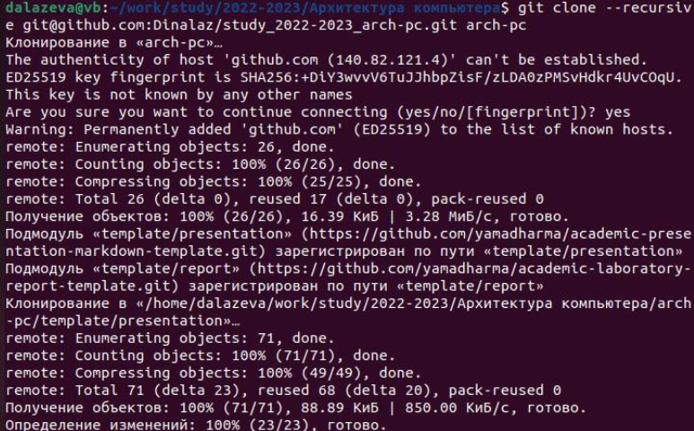
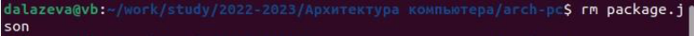
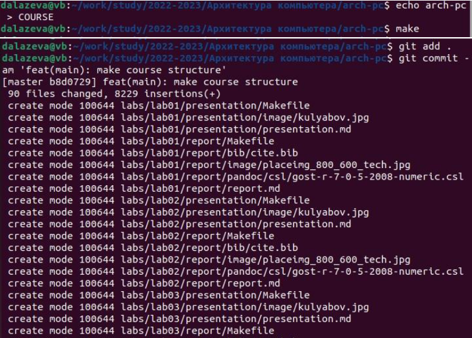
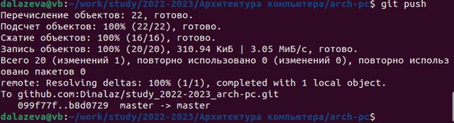

---
## Front matter
title: "Отчёт по лаболаторной работе номер 3"
subtitle: "Архитектура программирования"
author: "Федоров Андрей Андреевич"

## Generic otions
lang: ru-RU
toc-title: "Содержание"

## Bibliography
bibliography: bib/cite.bib
csl: pandoc/csl/gost-r-7-0-5-2008-numeric.csl

## Pdf output format
toc: true # Table of contents
toc-depth: 2
lof: true # List of figures
lot: true # List of tables
fontsize: 12pt
linestretch: 1.5
papersize: a4
documentclass: scrreprt
## I18n polyglossia
polyglossia-lang:
name: russian
options:
- spelling=modern
- babelshorthands=true
polyglossia-otherlangs:
name: english
## I18n babel
babel-lang: russian
babel-otherlangs: english
## Fonts
mainfont: PT Serif
romanfont: PT Serif
sansfont: PT Sans
monofont: PT Mono
mainfontoptions: Ligatures=TeX
romanfontoptions: Ligatures=TeX
sansfontoptions: Ligatures=TeX,Scale=MatchLowercase
monofontoptions: Scale=MatchLowercase,Scale=0.9
## Biblatex
biblatex: true
biblio-style: "gost-numeric"
biblatexoptions:
- parentracker=true
- backend=biber
- hyperref=auto
- language=auto
- autolang=other*
- citestyle=gost-numeric
## Pandoc-crossref LaTeX customization
figureTitle: "Рис."
tableTitle: "Таблица"
listingTitle: "Листинг"
lofTitle: "Список иллюстраций"
lotTitle: "Список таблиц"
lolTitle: "Листинги"
## Misc options
indent: true
header-includes:
- \usepackage{indentfirst}
- \usepackage{float} # keep figures where there are in the text
- \floatplacement{figure}{H} # keep figures where there are in the text
---

# Цель работы

Изучить идеологию и применение средств контроля версий. Приобрести практические навыки по работе с системой git

# Задание

1. Создайте отчет по выполнению лабораторной работы в соответствующем
каталоге рабочего пространства (labs>lab03>report).
2. Скопируйте отчеты по выполнению предыдущих лабораторных работ в
соответствующие каталоги созданного рабочего пространства.
3. Загрузите файлы на github.

# Выполнение лабораторной работы

1. Cначала сделаем предварительную конфигурацию git. Открываем терминал. Вводим команды, указав свое имя и mail. Команда “config” используется для конфигурации файлов [-@fig:001]

{ #fig:001 width=90% }

2. Настраиваем utf-8 (кодировка символа) (рис. [-@fig:002])

{ #fig:002 width=90% }

3. Задаем имя начальной ветки master (рис. [-@fig:003])

{ #fig:003 width=90% }

4. Параметр autocrlf input (делает перевод строк текстовых файлов в главный репозиторий . Конвертация CRLF в LF) (рис. [-@fig:004])

{ #fig:004 width=90% }

5. Параметр safecrlf warn (Git проверяет, если преобразование является обратным для текущей на стройки. Печать толь ко предупреждения, но принимает необратимый переход ) [-@fig:005]

{ #fig:005 width=90% }

6. Сгенерируем ключ, команда ssh (подключение сервера) (рис. [-@fig:006])

{ #fig:006 width=90% }

7. Копируем с помощью команда cat (команда для копирования) - Xclip (утилита для работы с буфером обмена из консоли) (рис. [-@fig:007])

{ #fig:007 width=90% }

8. Далее генерируем ключ через сайт ГитХаб (github.com). Называем ключ “Title” (рис. [-@fig:008])

{ #fig:008 width=90% }

9. Создаем каталог предмета “Архитектура компьютера” команда mkdir [-@fig:009]

{ #fig:009 width=90% }

10. По ссылке переходим на страницу с шаблоном репозитория. Создаем репозиторий, называем “Study_2022-2023_arch-pc” (рис. [-@fig:010])

{ #fig:010 width=90% }

11. Переходим в каталог курса с помощью команды cd (рис. [-@fig:011])

{ #fig:011 width=90% }

12. Клонируем репозиторий через команду clone (клонирование) (рис. [-@fig:012])

{ #fig:012 width=90% }

14. Переходим в каталог курса cd (рис. [-@fig:013])

{ #fig:013 width=90% }

15. Удаляем не нужные файлы через команду rm (удаление файлов) (рис. [-@fig:014])

{ #fig:014 width=90% }

16. Создаем необходимые каталоги. - echo (вывод текста на экран (рис. [-@fig:015])

{ #fig:015 width=90% }

17. Отправляем файлы на сервер (рис. [-@fig:016])

{ #fig:016 width=90% }

# Выводы

Я изучил идеологию и применение средств контроля версий и приобрел практические навыки по работе с системой git

# Список литературы{.unnumbered}

::: {#refs}
:::
